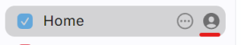
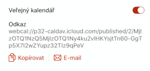
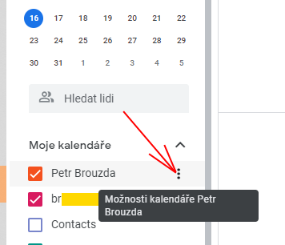
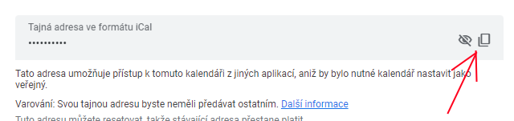
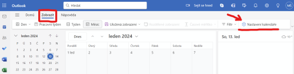
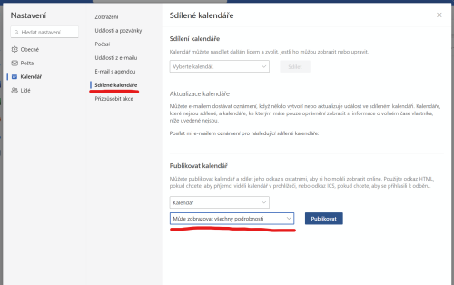
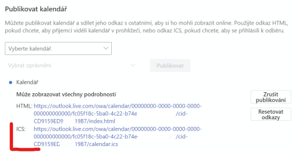

# IcalTransformer

Načte ICAL verzi Apple, Google nebo MS Office kalendáře a vrátí události v zadaném časovém okně ve formě jednoduchého JSON dokumentu.
Vyzkoušejte si přes **přehledný testovací formulář** na adrese https://lovecka.info/IcalTransformer/

Je určeno např. pro zobrazení kalendáře na displejích meteostanic se slabým procesorem.

Stahované ICAL kalendáře si aplikace kešuje - nestahuje je častěji než jednou za hodinu, i když přijde požadavek častěji. 
Stejně tak si kešuje i další zpracování dokumentu. 
I pokud budete zasílat požadavky opakovaně častěji, k výpočtům dojde jen jednou za hodinu.

---
# Volání a parametry

Stránka pro podání JSON dat sedí na adrese https://vas-server/IcalTransformer/ical/data
(možno vyzkoušet na https://lovecka.info/IcalTransformer/ical/data )
a bere následující GET parametry:

*  **url** - URL ICAL kalendáře; může být více adres oddělených znakem "pípa", tedy |. Musí bát URL-encoded!
*  **format** - "json" nebo "html"
*  **htmlAllowed** - "no" znamená, že v popisech události se ořežou HTML tagy; "yes" je tam nechá
*  **mode** - určení, které události se mají zobrazit. Buď "todayplus" nebo "daterange".

## mode=todayplus

Vrátí události od "teď" po několik dalších dní udaných parametrem **rangeDays** .
* rangeDays=0 .... vrátí od teď do dnešní půlnoci
* rangeDays=1 .... vrátí od teď do zítřejší půlnoci
* rangeDays=2 .... vrátí od teď do pozítřejší půlnoci

a tak dále (hodnota není omezena).

## mode=daterange

Očekává dva parametry:
* **from** - datum, od kterého má vracet události, YYYY-MM-DD. Události v tomto dni budou zahrnuty do výstupu.
* **to** - datum, do kterého má vracet události, YYYY-MM-DD. Události v tomto dni už nebudou zahrnuty do výstupu.


## Ukázka volání

Celé URL může vypadat třeba takto (privátní části odkazu jsou nahrazeny, takže URL není funkční):

```
https://lovecka.info/IcalTransformer/ical/data?url=https%3A%2F%2Fcalendar.google.com%2Fcalendar%2Fical%2FXXX.XXXXXX%2540gmail.com%2Fprivate-6ZZZZZZZZZZZZZ%2Fbasic.ics&rangeDays=2&format=json&htmlAllowed=no&mode=todayplus
```

## Struktura vráceného JSON

JSON je jednoduchý. Ke každé události obsahuje předmět (summary), text (description) a místo (location). A dále je zde uveden čas začátku a konce - pokaždé třikrát. Jednou v ISO formátu, podruhé jako unixový epoch time a naposledy v "lidsky čitelném" formátu, kdy u dneška není datum uveden, u zítřka je napsáno "zítra" a u dalších dní je formát třeba "čt 19.10. 15:45".

```
[
        {      
                "description": "",
                "location": "",
                "summary": "Softball",
                "time_start_i": "2023-10-17T17:00:00+02:00",
                "time_start_e": 1697554800,
                "time_start_t": "17:00",
                "time_end_i": "2023-10-17T19:00:00+02:00",
                "time_end_e": 1697562000,
                "time_end_t": "19:00"
        },
        {
                "description": "Pravidelné zkoušky se konají ve středu od 17:15 do 18:45 ve sborové zkušebně.",
                "location": "",
                "summary": "sbor",
                "time_start_i": "2023-10-18T17:15:00+02:00",
                "time_start_e": 1697642100,
                "time_start_t": "zítra 17:15",
                "time_end_i": "2023-10-18T18:45:00+02:00",
                "time_end_e": 1697647500,
                "time_end_t": "zítra 18:45"
        },
        {
                "description": "",
                "location": "VOŠ mezinárodního obchodu a Obchodní akademie Jablonec nad Nisou,Horní nám. 1200/15, 466 01 Jablonec nad Nisou, Česko",
                "summary": "Aj",
                "time_start_i": "2023-10-19T15:45:00+02:00",
                "time_start_e": 1697723100,
                "time_start_t": "čt 19.10. 15:45",
                "time_end_i": "2023-10-19T17:15:00+02:00",
                "time_end_e": 1697728500,
                "time_end_t": "čt 19.10. 17:15"
        }
]
```

---
# Jak získat URL na iCalendar soubor kalendáře?

Obecně je potřeba získat odkaz na neveřejnou adresu kalendáře ve formátu ICS, což lze bez problému u Applu, Googlu i Microsoftu najít v nastavení sdílení konkrétního kalendáře.

## Apple

**Z počítače:**
 * Na iCloud.com se přihlaste do svého Apple účtu.
 * Zvolte v aplikacích Kalendář:

 * V levém menu u konkrétního kalendáře zvolte možnost "Sdílet kalendář" (ikona uživatele):

 * Zapněte možnost veřejný kalendář:

 * A odkaz si zkopírujte.


**Z telefonu:** 
 * V aplikaci Kalendáře zobrazte seznam/přehled událostí a tapněte dole na liště na odkaz "Kalendáře".
 * U konkrétního kalendáře dejte v řádku "i" pro více informací.
 * Zapněte "Veřejný kalendář" a dejte "Sdílet odkaz", který následně můžete přeposlat.

## Google

 * Otevřete si svůj Google kalendář.
 * Na levé straně pod měsíčním kalendářem a hledacím polem je seznam zobrazených kalendářů. Klikněte na trojtečku u konkrétního kalendáře:



 * Zvolte "Nastavení a sdílení":


 * Najděte položku "Tajná adresa ve formátu iCal" a klikněte na ikonu kopírování u ní.



 * Pokud tam tuto možnost nemáte (je tam jen "veřejná adresa"), nejste přímým vlastníkem kalendáře - typicky u firemních/školních účtů.

## Microsoft

 * Ve webové verzi Office kalendáře zvolte v horním menu "Zobrazit" a "Nastavení kalendáře" (případně jen ikona ozubeného kola):

 
 
* V nastavení v levém menu pod "Kalendář" zvolte položku "Sdílené kalendáře" a zde v sekci "Publikovat kalendář" přepněte oprávnění na "Může zobrazovat všechny podrobnosti" a klikněte na "Publikovat":


 
 * Následně se vám ukážou dva odkazy ze zkopírování - zkopírujte ten ICS:



---
# Popis instalace

Potřebujete:

* webový server s podporou pro přepisování URL – tedy pro Apache httpd je potřeba zapnutý **mod_rewrite**
* rozumnou verzi PHP (nyní mám v provozu na 8.1, mělo by to fungovat na 8.0 a novějších)

Instalační kroky:

1) Stáhněte si celou serverovou aplikaci z githubu.

2) V adresáři vašeho webového serveru (nejčastěji něco jako /var/www/) udělejte adresář pro aplikaci, třeba "IcalTransformer". Bude tedy existovat adresář /var/www/IcalTransformer přístupný zvenčí jako https://vas-server/IcalTransformer/ .

3) V konfiguraci webserveru (zde předpokládám Apache) povolte použití vlastních souborů .htaccess v adresářích aplikace – v nastavení /etc/apache2/sites-available/vaše-site.conf pro konkrétní adresář povolte AllowOverride

Tj. pro konfiguraci ve stylu Apache 2.2:
```
<Directory /var/www/IcalTransformer/>
        AllowOverride all
        Order allow,deny
        allow from all
</Directory>
```
a ekvivalentně pro Apache 2.4:
```
<Directory /var/www/IcalTransformer/>
        AllowOverride all
        Require all granted
</Directory>
```


4) Nakopírujte obsah podadresáře aplikace/ do vytvořeného adresáře; vznikne tedy /var/www/IcalTransformer/app ; /var/www/IcalTransformer/data; ...

5) Přidělte webové aplikaci právo zapisovat do adresářů log a temp! Bez toho nebude nic fungovat. Nejčastěji by mělo stačit udělat v /var/www/IcalTransformer/ něco jako:

```
sudo chown www-data:www-data log temp
sudo chmod u+rwx log temp
```

8) No a nyní zkuste v prohlížeči zadat https://vas-server/IcalTransformer/  a měli byste dostat testovací stránku.

9) Pokud něco selže, čtěte soubor exception-*.html  v adresáři log/ 


## Řešení problémů, ladění a úpravy

Aplikace je napsaná v Nette frameworku. Pokud Nette neznáte, **důležitá informace**: Při úpravách aplikace či nasazování nové verze je třeba **smazat adresář temp/cache/** (tedy v návodu výše /var/www/IcalTransformer/temp/cache). V tomto adresáři si Nette ukládá předkompilované šablony, mapování databázové struktury atd. Smazáním adresáře vynutíte novou kompilaci.

Aplikace **loguje** do adresáře log/ do souboru app.YYYY-MM-DD.txt . Defaultně zapisuje základní informace o provozu; úroveň logování je možné změnit v app/Services/Logger.php v položce LOG_LEVEL.

Konfigurace aplikace je v app/Services/Config.php

Aplikace může být dle nastavení vašeho webserveru dostupná přes https nebo přes http (je jí to jedno).
